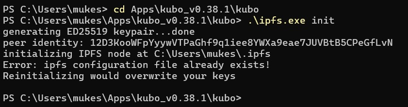
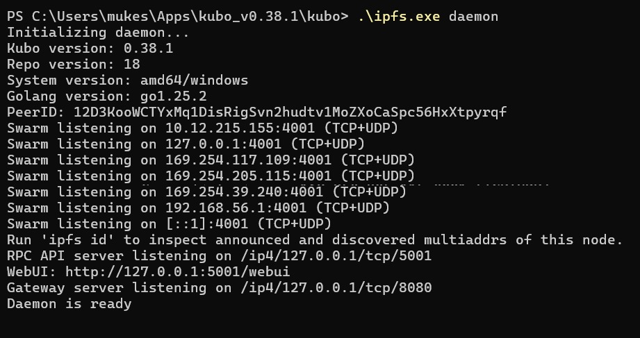
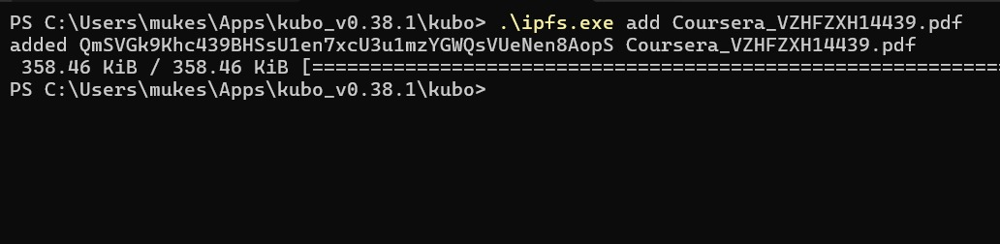
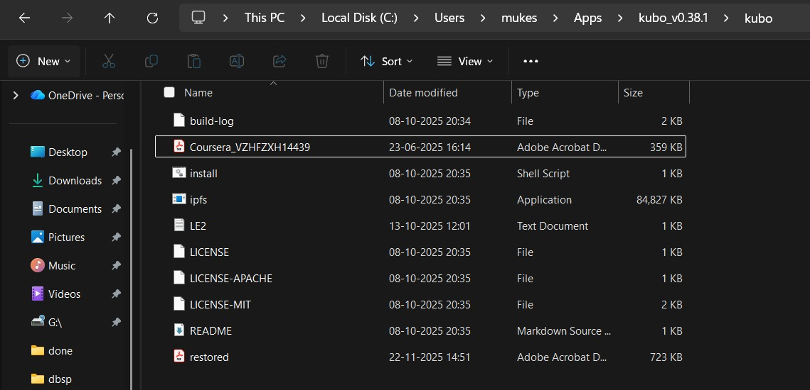
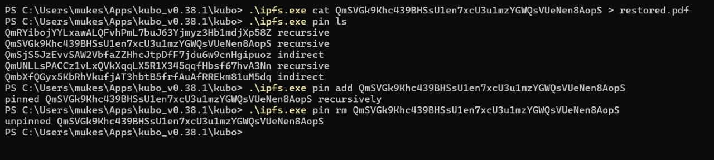

    

# 24CYS336 - Blockchain-Technology 

## 👨‍💻 Assignments - 1

### **Wallet Details** 💳
| Field | Value |
| :--- | :--- |
| **Name** | Mukesh Singh |
| **Wallet Address** | [0x69954b38F8f72aBAc68B18D1A457cB0c1E289bB8](https://etherscan.io/address/0x69954b38F8f72aBAc68B18D1A457cB0c1E289bB8) |

---

### **Lab 1.1 - Introduction to Solidity**

| Field | Value |
| :--- | :--- |
| **Smart Contract Address** | [0xa863B94A9F38DeEEBB576fd34b4517aCFB919863](https://etherscan.io/address/0xa863B94A9F38DeEEBB576fd34b4517aCFB919863) |
| **Status** | Smart Contract Deployment Failed |
| **Store Address** | `0x1c0a01ac2cdbe3e10714e844ac1fb2dd54bff1df36ce000c54bd91bf12b447ae` |

---

## 👨‍💻 Assignments - 2

### **Wallet Details** 💳
| Field | Value |
| :--- | :--- |
| **Name** | Mukesh Singh |
| **Wallet Address** | [0x5B38Da6a701c568545dCfcB03FcB875f56beddC4](https://etherscan.io/address/0x5B38Da6a701c568545dCfcB03FcB875f56beddC4) |

---

### **Lab 2.1 - Introduction to Solidity**

#### **Smart Contract 1**

| Field | Value |
| :--- | :--- |
| **Address** | [0xD4Fc541236927E2EAf8F27606bD7309C1Fc2cbee](https://etherscan.io/address/0xD4Fc541236927E2EAf8F27606bD7309C1Fc2cbee) |
| **Status** | Smart Contract Deployment successful |
| **From** | `0x5B38Da6a701c568545dCfcB03FcB875f56beddC4` |
| **To** | `0xaE036c65C649172b43ef7156b009c6221B596B8b` |
| **Execution Cost** | `2472` |
| **Output** | `uint64: 1` |

**Execution Screenshots**

  

---

#### **Smart Contract 2**

| Field | Value |
| :--- | :--- |
| **Address** | [0xaE036c65C649172b43ef7156b009c6221B596B8b](https://etherscan.io/address/0xaE036c65C649172b43ef7156b009c6221B596B8b) |
| **Status** | Smart Contract Deployment successful |
| **From** | `0x5B38Da6a701c568545dCfcB03FcB875f56beddC4` |
| **To** | `0xaE036c65C649172b43ef7156b009c6221B596B8b` |
| **Execution Cost** | `8732` |
| **Input** | `0x2fd3ffc4` |

**Execution Screenshots**

  

## 👨‍💻 Assignments - 3

### 🌐 **Lab 3.1 - Interplanetary File System**

#### 🧩 Step 1: IPFS Initialization

// 🧱 Step 1: Initialize IPFS repository  
// ✅ Creates a new local IPFS repository on the system  
// 🆔 Generates a unique peer identity (public–private key pair)  
// ⚙️ Prepares the default configuration required to run an IPFS node  

**Screenshot** 🖼️  

---

#### 🚀 Step 2: Starting the IPFS Daemon

// 🚀 Step 2: Start the IPFS daemon  
// 🔄 Launches the IPFS node as a background process  
// 🌍 Connects the node to the IPFS swarm (P2P network)  
// 📡 Allows the node to send, receive, and share IPFS blocks with other peers  

**Screenshot** 🖼️  

---

#### 📂 Step 3: Adding a File to IPFS

// 📂 Step 3: Add a file to IPFS  
// ✂️ Splits the file into small blocks and hashes them  
// 💾 Stores the blocks in the local IPFS repository  
// 🧾 Generates a unique CID (Content Identifier) for the file based on its content  

**Screenshot** 🖼️  

---

#### 📥 Step 4: Retrieving File Content (cat)

// 📥 Step 4: Retrieve file content using CID  
// 🔍 Uses the CID to locate the file in the IPFS network  
// 🔁 Reads the data either from the local repository or from other peers  
// 🧭 Demonstrates content-addressable access (file is fetched using hash, not path)  

**Screenshot** 🖼️  

---

#### 📌 Step 5: Pinning Content in IPFS

// 📌 Step 5: Pin important content  
// 📍 Marks the CID as "pinned" in the local IPFS node  
// 🛡️ Prevents IPFS garbage collection from removing the file’s data  
// ♻️ Ensures long-term availability of important files on the local node  

**Screenshot** 🖼️  
  
