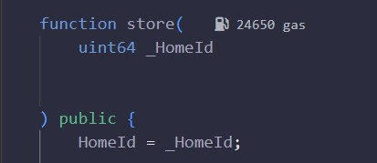
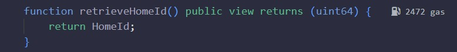
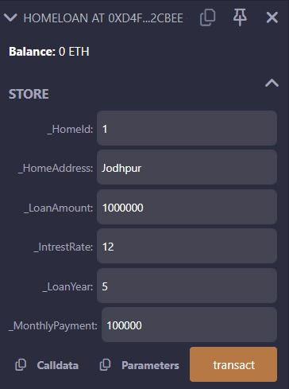
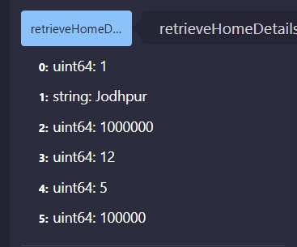

<p align="center">
    
</p>

# 24CYS336 - Blockchain-Technology 

## 👨‍💻 Assignments - 1


### **Wallet Details** 💳
| Field | Value |
| :--- | :--- |
| **Name** | Mukesh Singh |
| **Wallet Address** | [0x69954b38F8f72aBAc68B18D1A457cB0c1E289bB8](https://etherscan.io/address/0x69954b38F8f72aBAc68B18D1A457cB0c1E289bB8) |

---

### **Lab 1.1 - Introduction to Solidity**

| Field | Value |
| :--- | :--- |
| **Smart Contract Address** | [0xa863B94A9F38DeEEBB576fd34b4517aCFB919863](https://etherscan.io/address/0xa863B94A9F38DeEEBB576fd34b4517aCFB919863) |
| **Status** | Smart Contract Deployment Failed |
| **Store Address** | `0x1c0a01ac2cdbe3e10714e844ac1fb2dd54bff1df36ce000c54bd91bf12b447ae` |

---

## 👨‍💻 Assignments - 2


### **Wallet Details** 💳
| Field | Value |
| :--- | :--- |
| **Name** | Mukesh Singh |
| **Wallet Address** | [0x5B38Da6a701c568545dCfcB03FcB875f56beddC4](https://etherscan.io/address/0x5B38Da6a701c568545dCfcB03FcB875f56beddC4) |

---

### **Lab 1.2 - Introduction to Solidity**

#### **Smart Contract 1**

| Field | Value |
| :--- | :--- |
| **Address** | [0xD4Fc541236927E2EAf8F27606bD7309C1Fc2cbee](https://etherscan.io/address/0xD4Fc541236927E2EAf8F27606bD7309C1Fc2cbee) |
| **Status** | Smart Contract Deployment successful |
| **From** | `0x5B38Da6a701c568545dCfcB03FcB875f56beddC4` |
| **To** | `0xaE036c65C649172b43ef7156b009c6221B596B8b` |
| **Execution Cost** | `2472` |
| **Output** | `uint64: 1` |

**Execution Screenshots**

  


---

#### **Smart Contract 2**

| Field | Value |
| :--- | :--- |
| **Address** | [0xaE036c65C649172b43ef7156b009c6221B596B8b](https://etherscan.io/address/0xaE036c65C649172b43ef7156b009c6221B596B8b) |
| **Status** | Smart Contract Deployment successful |
| **From** | `0x5B38Da6a701c568545dCfcB03FcB875f56beddC4` |
| **To** | `0xaE036c65C649172b43ef7156b009c6221B596B8b` |
| **Execution Cost** | `8732` |
| **Input** | `0x2fd3ffc4` |

**Execution Screenshots**

  


**Decoded Output**
```json
{
  "0": "uint64: 1",
  "1": "string: Jodhpur",
  "2": "uint64: 1000000",
  "3": "uint64: 12",
  "4": "uint64: 5",
  "5": "uint64: 100000"
}


