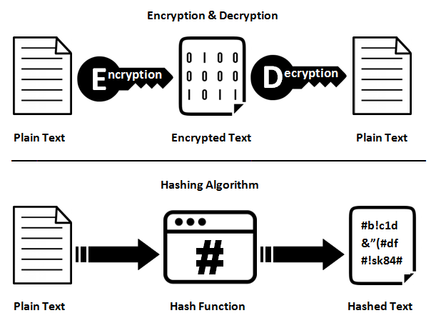
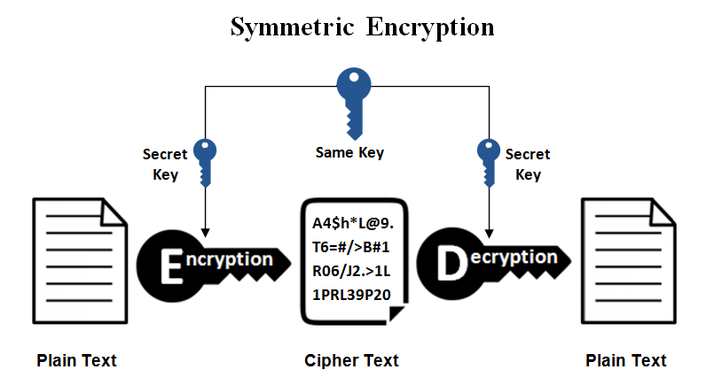
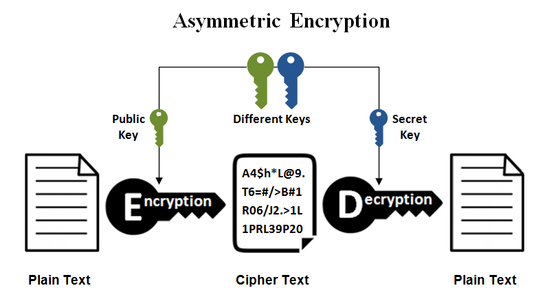

<p align="center">
    
</p>

# 24CYS336 - Blockchain-Technology 
   <br/>
    <br/>

## Lab 3: Crypto Primitives

## Cryptographic Hash Algorithm

<p align="center">
    
</p>

## Symmetric Key Cryptography

<p align="center">
    
</p>

## Asymmetric Key (Public Key Cryptography)

<p align="center">
    
</p>

### Encryption and Decryption

### Digital Signature

### Assymmetric Key Encryption and Decryption (using RSA) for Symmetric Key Exchange [Correct]

#### Given:
- **Public Key (n, e):** (119, 5)  
- **Private Key (n, d):** (119, 77)  
- **Symmetric Key:** 44


#### (a) Encrypt the symmetric key using the public key:
The encryption formula is:  
```
C = (M^e) mod n
```
Where:  
\[
M = 44,  e = 5, n = 119
\]

**Step-by-step modular exponentiation:**  
1. \( 44^2 mod 119 = 1936 mod 119 = 32 \)  
2. \( 44^4 mod 119 = (32^2) mod 119 = 72 \)  
3. \( 44^5 mod 119 = (72 o 44) mod 119 = 3168 mod 119 = 74 \)  

**Encrypted Symmetric Key:**  
\[
C = 74
\]

---
#### (b) Decrypt the encrypted symmetric key using the private key:
The decryption formula is:  
```
M = (C^d) mod n
```
Where:  
\[
C = 74, d = 77, n = 119
\]

**Step-by-step modular exponentiation:**  
1. \( 74^2 mod 119 = 5476 mod 119 = 2 \)  
2. \( 74^32 mod 119 = (2^16) mod 119 = 86 \)
3. \( 74^{77} mod 119 = (86 o 86 o 16 o 4 o 74) mod 119 = 35027456 mod 119 = 44 \)  

**Decrypted Symmetric Key:**  
\[
M = 44
\]

---

### Assymmetric Key Encryption and Decryption (using RSA) for Symmetric Key Exchange [InCorrect]

#### Given:
- **Public Key (n, e):** (119, 7)  
- **Private Key (n, d):** (119, 103)  
- **Symmetric Key:** 45  

---

#### (a) Encrypt the symmetric key using the public key:
The encryption formula is:  
\[
C = (45^7) mod 119
\]


**Step-by-step modular exponentiation:**  
1. \( 45^2 mod 119 = 2025 mod 119 = 2 \)  
2. \( 45^7 mod 119 = (4 o 2 o 45) mod 119 = 360 mod 119 = 3 \)  

**Encrypted Symmetric Key:**  
\[
C = 3
\]

---

#### (b) Decrypt the encrypted symmetric key using the private key:
The decryption formula is:  
\[
M = (3^103) mod 119
\]

**Step-by-step modular exponentiation:**  
1. \( 3^8 mod 119 = 6561 mod 119 = 16 \)
2. \( 3^32 mod 119 = (16^4) mod 119 = 86 \)
3. \( 3^64 mod 119 = (86^2) mod 119 = 18 \)
4. \( 3^{103} mod 119 = (18 o 86 o 81 o 27 ) mod 119 =  (1548 o 2187) mod 119 =  (1 o 45 )108 \)  

**Decrypted Symmetric Key:**  
\[
M = 45
\]

---

#### (c) Reason for Incorrectness 
As per RSA Algorithm:
- Following condition should be satisfied for the values of _e_ and _d_
```
  e * d mod phi(n) = 1
```

#### Additional Resource: [RSA Calculator](https://www.cs.drexel.edu/~popyack/IntroCS/HW/RSAWorksheet.html)
