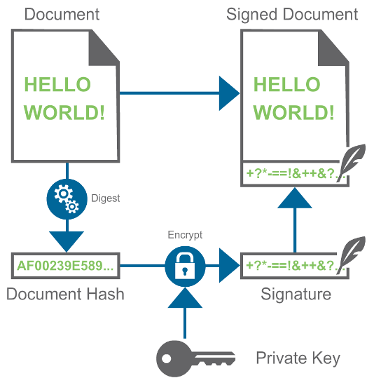

<p align="center">
    
</p>

# 24CYS336 - Blockchain-Technology 
   <br/>
    <br/>

## Lab 3: Crypto Primitives


## Cryptographic Hash Algorithm

Crytographic Hash Function is a one-way mathematical function which takes any arbitary length input and generates a fixed length output. 

Let us consider _x_ is the input _f(x)_ is the cryptographic hash function which will provide hash value _Y_, then we can say _f(x) = Y._

<p align="center">
    
</p>

Most commonly used Cryptographic Hash Algorithm includes Message Digest (MD) Family and Secure Hash Algorithm (SHA) Family. 

Explore more [here](https://www.pelock.com/products/hash-calculator)

## Symmetric Key Cryptography

Symmetric Key Cryptography uses the same key for _encryption_ and _decryption_.  The challenge here is the Key Exchange. 

<p align="center">
    
</p>

## Asymmetric Key Cryptography (Public Key Cryptography)

Asymmetric Key Cryptography uses the two different keys for _encryption_ and _decryption_. _Public Key_ and _Private Key_ pairs are generated, where _Public Key_ is made available to everyone through a central database and _Private Key_ is made available ONLY to the concerend user. 

### Encryption and Decryption

When it comes to ensuring the Confidentiality of the data, we encrypt and decrypt the data. Encryption is using the Receiver's Public Key and Decryption is using the Receiver's Private Key. 

<p align="center">
    
</p>

---
### Digital Signature

When it comes to ensuring the Integrity of the data, we sign (encrypt) and verify (decrypt) the hash of the data. Signing (Encryption) is using the Senders's Private Key and Verification (Decryption) is using the Sender's Public Key. 

<p align="center">
    
</p>

---
### Example 1 : Assymmetric Key Encryption and Decryption (using RSA) for Symmetric Key Exchange

#### Given:
- **Public Key (n, e):** (119, 5)  
- **Private Key (n, d):** (119, 77)  
- **Symmetric Key:** 44


#### (a) Encrypt the symmetric key using the public key:
The encryption formula is:  
```
C = (M^e) mod n
```
Where:  
\[
M = 44,  e = 5, n = 119
\]

**Step-by-step modular exponentiation:**  
1. \( 44^2 mod 119 = 1936 mod 119 = 32 \)  
2. \( 44^4 mod 119 = (32^2) mod 119 = 72 \)  
3. \( 44^5 mod 119 = (72 o 44) mod 119 = 3168 mod 119 = 74 \)  

**Encrypted Symmetric Key:**  
\[
C = 74
\]

#### (b) Decrypt the encrypted symmetric key using the private key:
The decryption formula is:  
```
M = (C^d) mod n
```
Where:  
\[
C = 74, d = 77, n = 119
\]

**Step-by-step modular exponentiation:**  
1. \( 74^2 mod 119 = 5476 mod 119 = 2 \)  
2. \( 74^32 mod 119 = (2^16) mod 119 = 86 \)
3. \( 74^{77} mod 119 = (86 o 86 o 16 o 4 o 74) mod 119 = 35027456 mod 119 = 44 \)  

**Decrypted Symmetric Key:**  
\[
M = 44
\]

---

### Example 2: Assymmetric Key Encryption and Decryption (using RSA) for Symmetric Key Exchange (Special Case)

#### Given:
- **Public Key (n, e):** (119, 7)  
- **Private Key (n, d):** (119, 103)  
- **Symmetric Key:** 45  


#### (a) Encrypt the symmetric key using the public key:
The encryption formula is:  
\[
C = (45^7) mod 119
\]


**Step-by-step modular exponentiation:**  
1. \( 45^2 mod 119 = 2025 mod 119 = 2 \)  
2. \( 45^7 mod 119 = (4 o 2 o 45) mod 119 = 360 mod 119 = 3 \)  

**Encrypted Symmetric Key:**  
\[
C = 3
\]


#### (b) Decrypt the encrypted symmetric key using the private key:
The decryption formula is:  
\[
M = (3^103) mod 119
\]

**Step-by-step modular exponentiation:**  
1. \( 3^8 mod 119 = 6561 mod 119 = 16 \)
2. \( 3^32 mod 119 = (16^4) mod 119 = 86 \)
3. \( 3^64 mod 119 = (86^2) mod 119 = 18 \)
4. \( 3^{103} mod 119 = (18 o 86 o 81 o 27 ) mod 119 =  (1548 o 2187) mod 119 =  (1 o 45 )108 \)  

**Decrypted Symmetric Key:**  
\[
M = 45
\]

---

### Verification of e and d pairs.
As per RSA Algorithm:
- Following condition should be satisfied for the values of _e_ and _d_
```
  e * d mod phi(n) = 1
```

#### Additional Resource: [RSA Calculator](https://www.cs.drexel.edu/~popyack/IntroCS/HW/RSAWorksheet.html)

### Exercise 
Implement a Menu-driven Program in Python (or language of your choice) that performs RSA Encryption and Decryption. The values of e, d, and n can be either received as input or hardcorded. 
