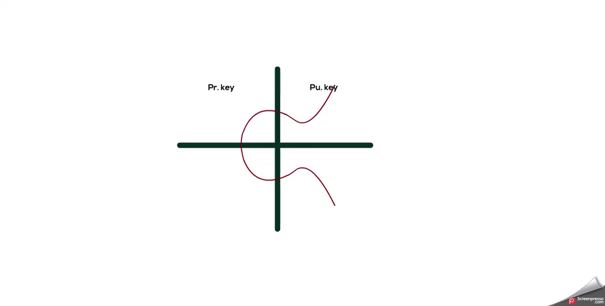

# 24CYS336 - Blockchain-Technology 

## Bitcoin Address Generation

- Generate a private ECDSA key
- Take the corresponding public key generated with it (33 bytes, 1 byte 0x02 (y-coord is even), and 32 bytes corresponding to X coordinate)
- Perform SHA-256 hashing on the public key
- Perform RIPEMD-160 hashing on the result of SHA-256
- Add version byte in front of RIPEMD-160 hash (0x00 for Main Network)
- Perform SHA-256 hash on the extended RIPEMD-160 result
- Perform SHA-256 hash on the result of the previous SHA-256 hash
- Take the first 4 bytes of the second SHA-256 hash. This is the address checksum
- Add the 4 checksum bytes from stage 7 at the end of extended RIPEMD-160 hash. This is the 25-byte binary Bitcoin Address.
- Convert the result from a byte string into a base58 string using Base58Check encoding. This is the most commonly used Bitcoin Address format

<p align="center">
    
</p>

```
"""
Bitcoin Address Generator
-------------------------
Generates a Bitcoin P2PKH address from a randomly generated ECDSA (secp256k1) key pair.

Author: Ramaguru Radhakrishnan
"""

import os
import ecdsa
import hashlib
import base58

def generate_bitcoin_address():
    # Step 1: Generate Private Key
    private_key = os.urandom(32)
    print("\nStep 1: Private Key (hex):")
    print(private_key.hex())

    # Step 2: Derive Public Key (Compressed)
    sk = ecdsa.SigningKey.from_string(private_key, curve=ecdsa.SECP256k1)
    vk = sk.get_verifying_key()
    public_key_bytes = b'\x02' + vk.to_string()[:32] if vk.to_string()[63] % 2 == 0 \
        else b'\x03' + vk.to_string()[:32]

    print("\nStep 2: Public Key (compressed hex):")
    print(public_key_bytes.hex())
    
    #public_key_hex = "0250863ad64a87ae8a2fe83c1af1a8403cb53f53e486d8511dad8a04887e5b2352"
    #public_key_bytes = bytes.fromhex(public_key_hex)
    

    # Step 3: SHA-256 of Public Key
    sha256_pk = hashlib.sha256(public_key_bytes).digest()
    print("\nStep 3: SHA-256(public key):")
    print(sha256_pk.hex())

    # Step 4: RIPEMD-160 of SHA-256
    ripemd160 = hashlib.new('ripemd160')
    ripemd160.update(sha256_pk)
    pubkey_hash = ripemd160.digest()
    print("\nStep 4: RIPEMD-160(SHA-256(public key)):")
    print(pubkey_hash.hex())

    # Step 5: Add version byte
    versioned_payload = b'\x00' + pubkey_hash
    print("\nStep 5: Version + RIPEMD-160 hash:")
    print(versioned_payload.hex())

    # Step 6 & 7: Calculate checksum (Double SHA2-256)
    sha256checksum = hashlib.sha256(hashlib.sha256(versioned_payload).digest()).digest()
    print("\nStep 6: SHA256(versioned payload):")
    print(sha256checksum.hex())
    checksum = hashlib.sha256(hashlib.sha256(versioned_payload).digest()).digest()[:4]
    print("\nSHA256(versioned payload):")
    print(checksum.hex())


    # Step 8: Append checksum
    full_payload = versioned_payload + checksum
    print("\nStep 7: Full payload (with checksum):")
    print(full_payload.hex())

    # Step 9: Base58Check encoding to get Bitcoin Address
    address = base58.b58encode(full_payload).decode()
    print("\nStep 8: Final Bitcoin Address:")
    print(address)

    return private_key.hex(), public_key_bytes.hex(), address


if __name__ == "__main__":
    generate_bitcoin_address()

```

