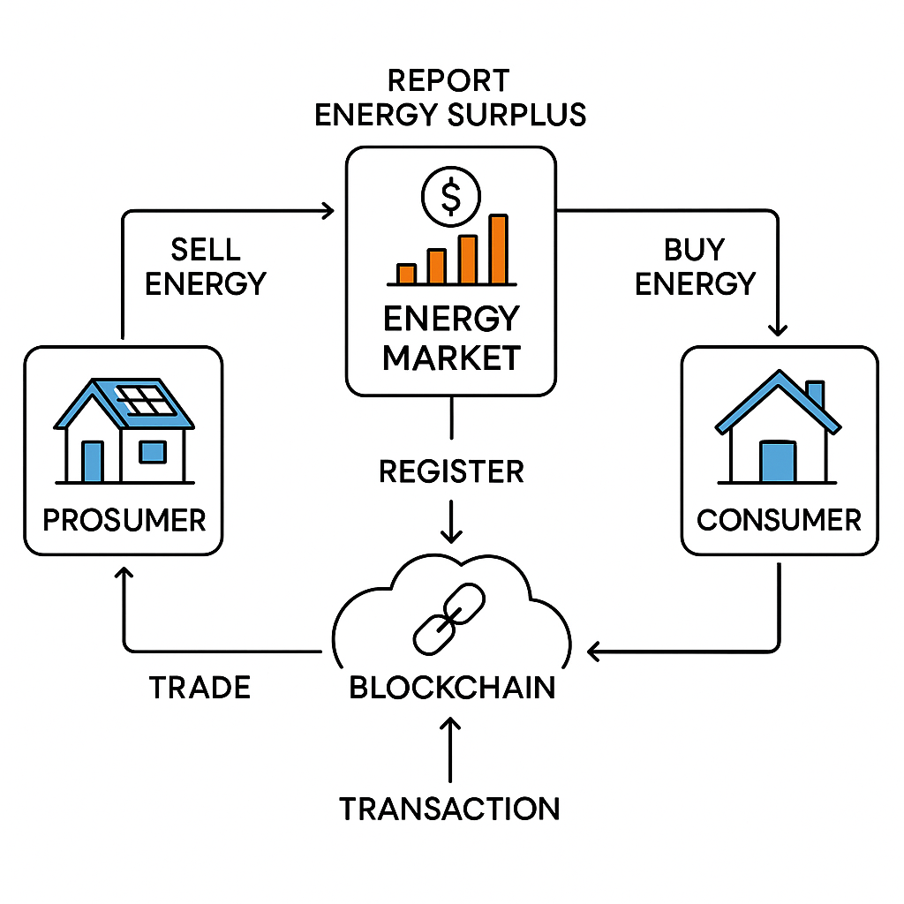

Table of Contents

Introduction
# EnergyMarket Smart Contract

A Solidity-based smart contract facilitating peer-to-peer (P2P) energy trading and load management on the blockchain. This system enables registered prosumers (both producers and consumers of energy) to transparently report, trade, and track surplus energy, providing the backbone for decentralized energy marketplaces and load flow analysis.

---

## 🔷 Energy Market Flow Diagram

---

## 📑 Table of Contents

- [Introduction](#introduction)
- [Problem Statement](#problem-statement)
- [How Blockchain Helps](#how-blockchain-helps)
- [NITI Aayog Blockchain](#niti-aayog-blockchain-flow-ascii)
- [Features](#features)
- [Contract Overview](#contract-overview)
- [Usage](#usage)
- [Events](#events)
- [Compilation & Deployment](#compilation--deployment)
- [License](#license)

---

## 📘 Introduction

As smart grids integrate increasing numbers of distributed renewable generators, managing energy production, consumption, and load flow becomes more complex.  
The **EnergyMarket** contract demonstrates how blockchain and autonomous smart contracts can automate and secure P2P energy trades, empowering prosumers and optimizing grid load balancing with auditable, real-time data.

---

## ⚡ Problem Statement — Load Flow Analysis Using Smart Grid

Modern grid systems face:

- decentralized, unpredictable generation  
- dynamic consumption  
- difficulty in sharing real-time load data  
- lack of transparent prosumer trading  
- risk of tampered or inaccurate load flow records  

Traditional centralized systems are not sufficient for future smart grids.

---

## 🔐 How Blockchain Helps

Blockchain enables:

- ✔ Tamper-proof load & trade records  
- ✔ Transparent energy surplus tracking  
- ✔ Automated trading via smart contracts  
- ✔ Decentralized validation  
- ✔ Real-time load flow visibility  

This aligns with **NITI Aayog’s vision** of trusted, decentralized public infrastructure.

---

## 🏛 NITI Aayog Blockchain 

## Why Blockchain? (Problem Fit)

This checklist evaluates the project against standard criteria for determining if a blockchain solution is a good fit.

### 1. Are there multiple parties involved? → **YES**
* Prosumers
* Consumers
* Utility
* Distribution company
* Grid operator
> **✔ Multiple independent entities → blockchain recommended.**

---

### 2. Do these parties trust each other fully? → **NO**
* Prosumers may cheat surplus values.
* Buyers may fake demand.
* Utility may alter data.
* Load flow data may be manipulated.
> **✔ When trust is low, blockchain ensures fairness.**

---

### 3. Is data coming from multiple distributed sources? → **YES**
* Smart meters
* Prosumers
* Load flow sensors
* Decentralized renewable sites
> **✔ Blockchain is ideal for distributed environments.**

---

### 4. Is tamper-proof, auditable logging required? → **YES**
* Load flow analysis needs:
    * Transparent energy transfer
    * Verified surplus reporting
    * Immutable trade history
    * Audit trail for grid balancing
> **✔ Blockchain provides immutable logs.**

---

### 5. Is there a need to automate rules without human interference? → **YES**
* Prosumer registration
* Surplus reporting
* Energy trading
* Settlement (future version)
> **✔ Smart contracts automate these actions.**

---

### 6. Does centralization create a risk? → **YES**
* A centralized database can:
    * Alter records
    * Hide trades
    * Manipulate surplus data
> **✔ Blockchain removes a single point of failure.**

---

### 7. Are there benefits from decentralization? → **YES**
* Transparent load flow
* Decentralized trading
* Eliminates disputes
* Removes intermediary cost
> **✔ Major improvement over traditional databases.**

## ✅ Features

### 1. Prosumer Registration
* **What it is:** Only the contract owner can register new prosumers.
* **Why it matters:** Prevents unauthorized users from participating in energy trading.

### 2. Surplus Energy Reporting
* **What it is:** Registered prosumers can report how much extra energy (in kWh) they have.
* **Why it matters:** This updates their on-chain energy balance, making it available for trade.

### 3. Peer-to-Peer (P2P) Energy Trading
* **What it is:** Prosumers can directly trade energy with each other without a central authority.
* **Why it matters:** The smart contract automatically validates:
    * The seller has enough surplus.
    * The buyer is a registered prosumer.
    * All trade details are correct before execution.

### 4. Immutable Public Transaction History
* **What it is:** Every single trade is stored permanently on the blockchain.
* **Why it matters:** This creates a perfect, unchangeable log for:
    * Audit trails
    * Load flow analysis
    * Full transparency
    * Dispute resolution

### 5. Access Control (Owner & Prosumer)
* **What it is:** Functions are secured based on roles.
    * **Owner-only:** `registerProsumer()`
    * **Prosumer-only:** `reportEnergySurplus()`, `executeP2PTrade()`
* **Why it matters:** Provides robust security using OpenZeppelin's proven `Ownable` contract.

### 6. Fully Automated & Trustless Execution
* **What it is:** Once deployed, the contract rules execute exactly as written with no human interference.
* **Why it matters:** This removes the need for a trusted middleman and prevents any single party from manipulating trades.

### 7. Supports Load Flow Analysis
* **What it is:** The public transaction data can be fed into analytical tools.
* **Why it matters:** Utilities or grid analysts can use this real-time, verified data to:
    * Track energy movement across the P2P network.
    * Study grid load patterns.
    * Validate surplus generation reports.
    * Optimize overall grid performance.

## ✅ Contract Overview

The `EnergyMarket` smart contract manages prosumers, surplus reporting, P2P energy trading, and maintains an immutable record of all transactions.

### Data Structures

* `mapping(address => bool) isProsumer`
    * Tracks whether an address is a registered prosumer.
* `mapping(address => uint256) prosumerEnergyBalance`
    * Stores each prosumer's surplus energy in kWh.
* `Transaction[] transactionHistory`
    * Maintains a full list of all P2P trades executed.

### Core Functionalities

* **Register Prosumers:** Only the owner can add new prosumers.
* **Report Surplus:** Prosumers submit available surplus energy.
* **Execute Trades:** Transfers energy from seller → buyer.
* **Read Transactions:** Anyone can fetch the full trade log.

This structure allows transparent, secure, tamper-proof energy trading suitable for smart grid analysis.

## ✅ Events

Events allow easy tracking of contract actions on the blockchain:

* **`ProsumerRegistered(address prosumer)`**
    * Emitted when a new prosumer is added.

* **`EnergyReported(address prosumer, uint256 newBalance)`**
    * Logs surplus energy updates.

* **`TradeCompleted(address seller, address buyer, uint256 amountInKwh, uint256 timestamp)`**
    * Emitted after every successful P2P energy trade.

Events make it simple to monitor system behavior and integrate real-time dashboards.

    
